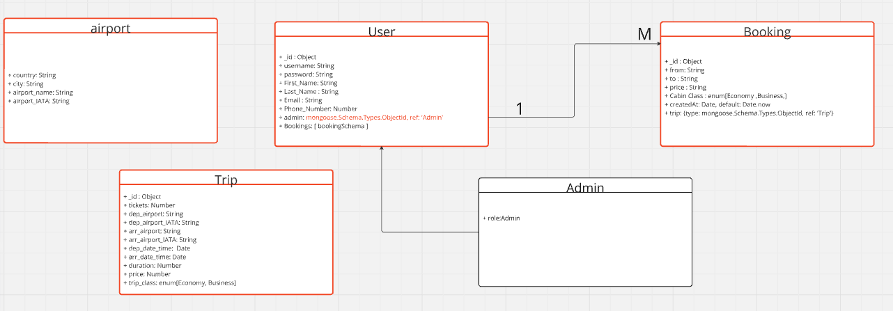
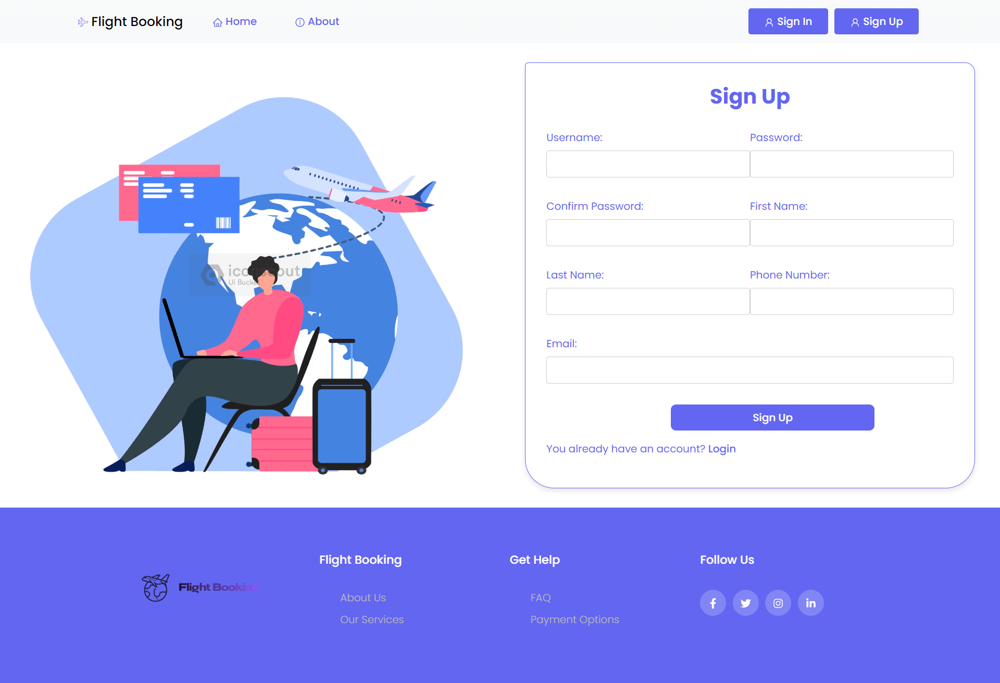
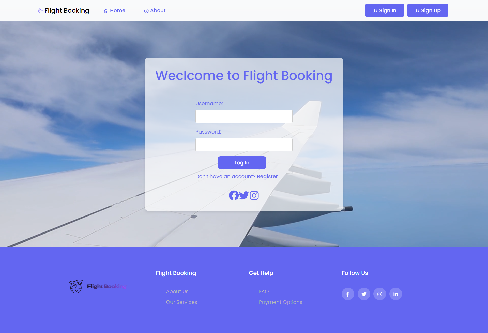
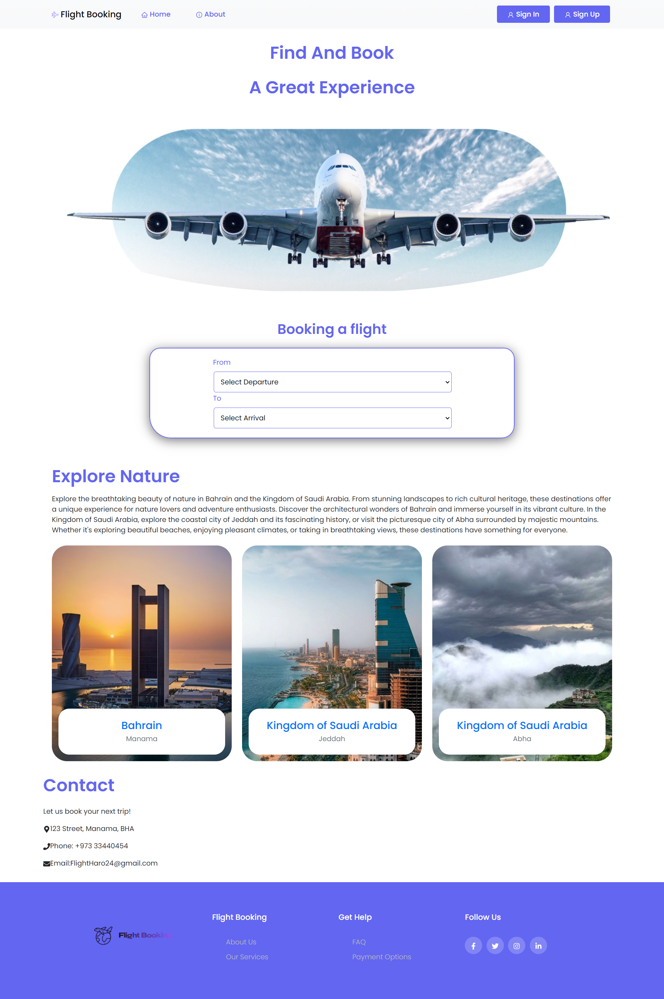
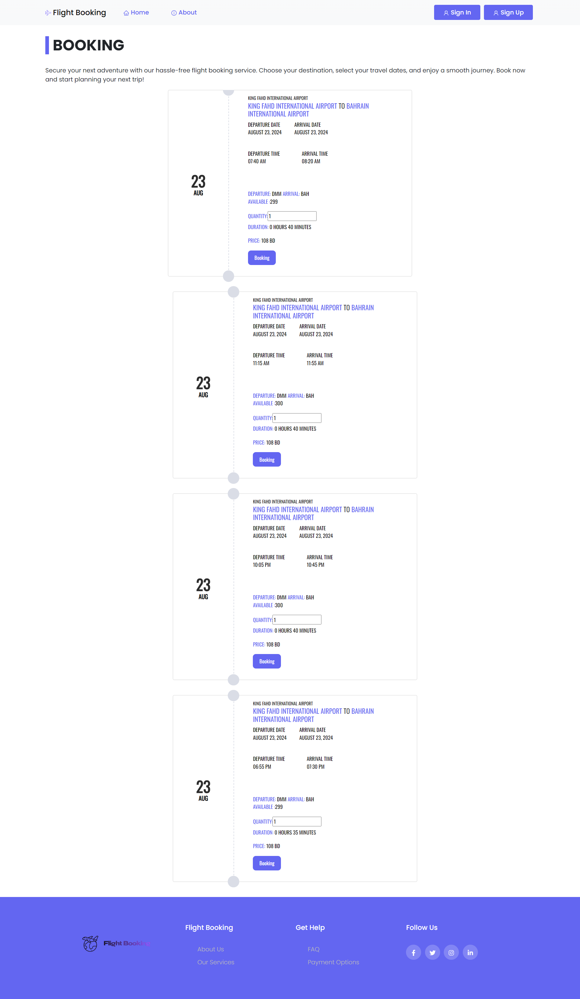

<h1 align="center">Flight Booking Appliction</h1>

#### Date: 22/8/2024
#### By: Haroon Ali Alnahdi , Ali lutfalla , Ali Abdulkarim

#### [GitHub](https://github.com/HaroonAlnhdi) | [LinkedIn](https://www.linkedin.com/in/haroon-alnhdi-849048309/) 
***

<h2 align="center">Description</h2>

The Flight Booking Application is a comprehensive platform designed for users to effortlessly book airline tickets and manage their travel plans. Users can browse available flights, view detailed trip schedules including departure and arrival times, and select from a range of flight options. 

The application is integrated with the Google Flights API, allowing for real-time flight data and seamless booking experiences. In addition to flight bookings, the app offers a variety of travel-related services, ensuring a fully customizable travel experience.

With its user-friendly interface and reliable functionality, the Flight Booking Application makes travel planning both convenient and efficient.

<b>User Stories</b>

1. As a user, Iwant to sign up to create new account  with uniqe username and hashed password.
2. As a user, I want to sign in to my account securely, so that I can access my bookings and personal information.

3. As a user, I want to book a flight ticket after selecting a flight, so that I can secure my seat on the plane.

4. As a user, I want to view detailed trip information including departure and arrival times, so that I can plan my schedule accordingly.

5. As a user, I want to see real-time flight availability and pricing, so that I can make informed booking decisions using accurate data from the Google Flights API.

6. As a user, I want to manage my profile details, so that I can update my personal information and preferences for future bookings.

7. As a user, I want to view my previous bookings, so that I can review my travel history and manage upcoming trips.

8. As a user, I want to contact customer support directly from the application, so that I can get assistance with my bookings and travel plans.

9. As a user, I want the application to be mobile-responsive, so that I can book and manage flights on my smartphone or tablet.

10. As a user, I want to cancel my flight booking and request a refund when necessary, so that I can adjust my travel plans in case of changes.

<b>Technologies Used</b>

* HTML
* CSS
* JavaScript
* Node.js
* React
* Express
* Npm
* MongoDB
* bootstrap
***

<h2 align="center">Getting Started</h2>

##### The project itself was deployed and can be viewed [Flight Booking Appliction](https://flight-booking-psi.vercel.app/).

***

<h2 align="center">Screenshots</h2>

<b>ERD</b>

The ERD  

Sign up

login

The landing page   

### ***Future Updates***

- [  ] support multi-city and round-trip bookings.
- [  ] Implement an AI-driven recommendation system that suggests flights, destinations, and services based on user preferences, travel history, and trends.

- [  ] Enable users to share their flight bookings and travel plans directly on social media platforms
- [x] Implement a system for users to provide feedback.

***
### ***Credits***

##### excalidraw for design UI of  the app: [excalidraw ](https://excalidraw.com/)
##### UUDI: [UUDI for session](https://www.uuidgenerator.net/)

##### Javascript Reference: [JS Search](https://www.thaicreate.com/javascript-manual/index.htm)

##### Colors: [Coolors.com](https://coolors.co/d6e681-babf95-c4ad83-c6b677-dbb957)

##### Icoins: [fontawesome.com](https://fontawesome.com/search)
##### HTML elements reference: [developer.mozilla](https://developer.mozilla.org/en-US/docs/Web/HTML/Element)

***

